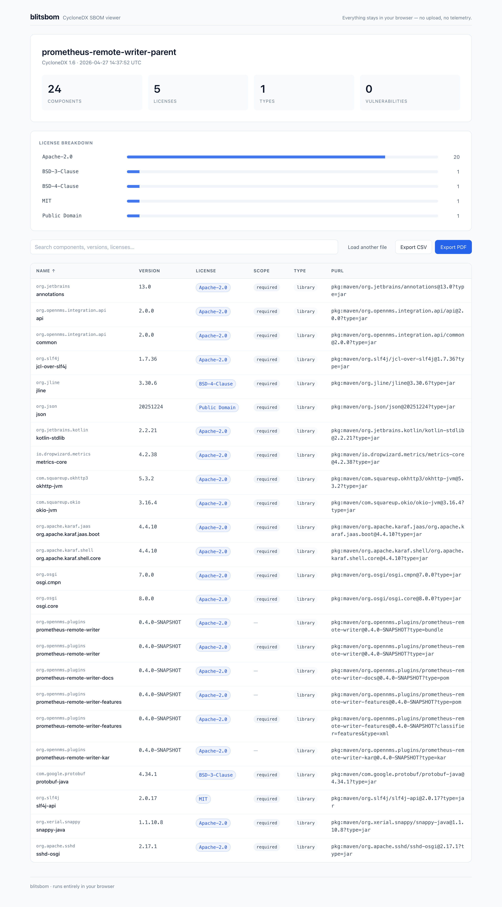
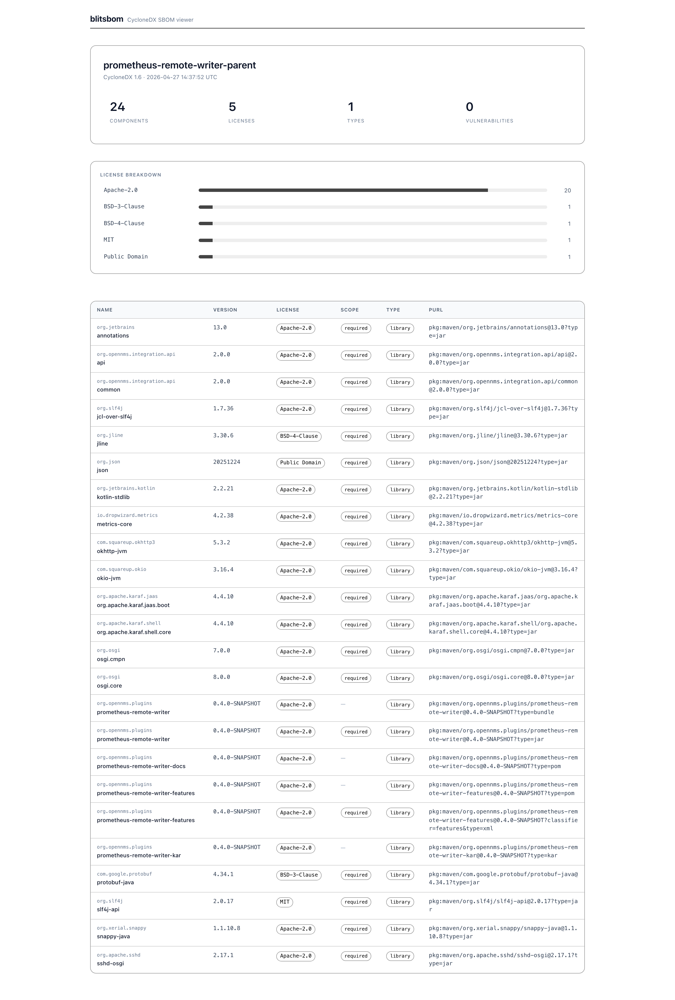

# blitsbom

A zero-install, browser-only viewer for [CycloneDX](https://cyclonedx.org/) SBOM files. Drop a `bom.json`, get a clean searchable view of your dependencies, hand it to legal as a CSV or PDF.

> **Privacy:** every byte stays in your browser. No upload, no phone-home, no telemetry. The page works with the network cable unplugged.



## Three install paths

### 1. Hosted (zero install)

Open the GitHub Pages site for this repository — drop your `bom.json` onto the page. Done.

### 2. Self-host (drop into any static server)

Each tagged release publishes a `dist.zip` of the built static files.

```bash
# Grab the latest release artifact
gh release download --pattern dist.zip

# Or extract into a webroot
unzip dist.zip -d /var/www/blitsbom
```

Any static server works: nginx, Apache, S3 + CloudFront, Caddy, `python -m http.server`, GitHub Pages on your own repo. blitsbom uses relative asset paths, so it runs from any subdirectory.

### 3. Air-gapped (double-click `index.html`)

For regulated or offline environments:

```bash
unzip dist.zip
open dist/index.html   # macOS
xdg-open dist/index.html  # Linux
```

It runs straight from a `file://` URL with no server. The bundle includes everything it needs — no CDNs, no fetched fonts, no external resources.

## Supported input

| Format | Versions | Status |
|--------|----------|--------|
| CycloneDX JSON | 1.4 / 1.5 / 1.6 | Supported |
| CycloneDX 1.0 – 1.3 | — | Rejected with a clear error (open an issue if you need it) |
| CycloneDX XML | — | Not yet — open an issue |
| SPDX | — | Not yet — open an issue |

### License expression handling

CycloneDX accepts SPDX expressions like `(MIT OR Apache-2.0)` as license entries. **In v1, blitsbom shows expressions verbatim and counts each expression as its own bucket in the breakdown chart** — it does not decompose them into the underlying SPDX ids. Single-id licenses (`{ "license": { "id": "Apache-2.0" } }`) work as you'd expect.

## Features

- Drag-and-drop or pick a `bom.json`
- Summary header: total components, distinct licenses, distinct types, vulnerability count
- Horizontal license breakdown chart (clickable — bars filter the table)
- Sortable component table with name / version / license / scope / type / purl
- Free-text search across name, version, license, scope, type, group, publisher, description, purl
- Click-to-toggle filter chips (license, scope, type)
- Filter state encoded in the URL — copy the address to share a view
- CSV export of the filtered view (RFC 4180, Excel-compatible)
- PDF export via the browser's native print dialog (clean print stylesheet, summary header doubles as the cover page)



## Developer workflow

```bash
make install     # npm install
make dev         # vite dev server
make build       # build static dist/
make test        # vitest
make verify      # lint + tests + network-purity check
make size-check  # fail if gzipped JS exceeds 60 KB
make smoke       # headless Chromium loading dist/index.html via file://
make dist-zip    # build and zip dist/ as dist.zip for self-hosters
```

CI invokes `make` targets, never the underlying npm scripts directly, so the developer and CI commands stay in sync.

## Deployment

- Pushing to `main` triggers `.github/workflows/pages.yml`, which builds, runs `make verify`, runs the size and `file://` smoke checks, and publishes `dist/` to GitHub Pages.
- Pushing a tag matching `v*` triggers `.github/workflows/release.yml`, which produces `dist.zip` and attaches it to the corresponding GitHub Release.

All third-party Actions are pinned to immutable commit SHAs and kept current by Dependabot.

## Project layout

```
src/
  parse/      CycloneDX parser, type guards, normalization
  state/      Svelte store, filter combinator, URL state
  ui/         Svelte components (AppShell, DropZone, SummaryHeader, ...)
  export/     CSV writer, PDF print trigger
  styles/     Tailwind v4 CSS entry (@theme static design tokens) + print stylesheet
scripts/      size-check, purity-check, file-smoke
test-fixtures/  reference SBOM used in unit tests
```

## License

MIT — see [LICENSE](./LICENSE).
